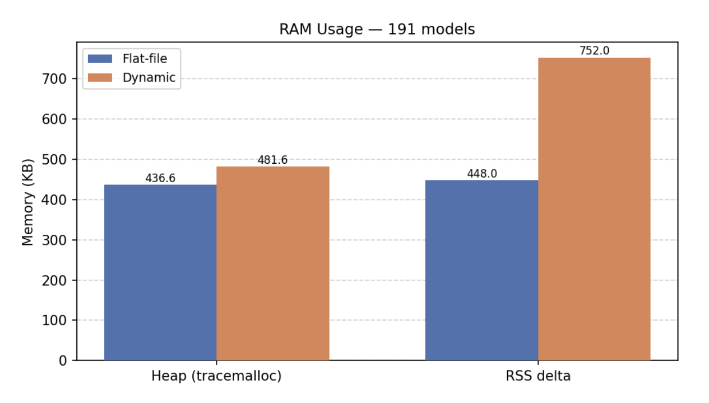
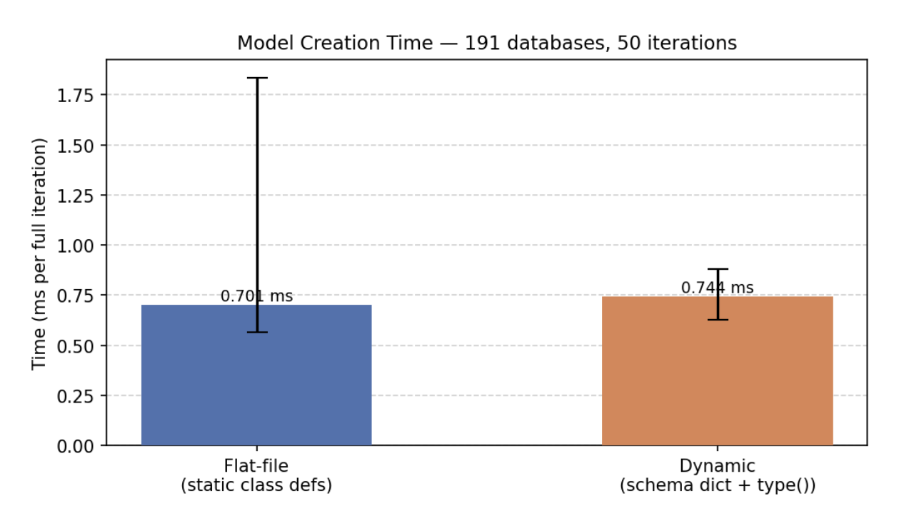
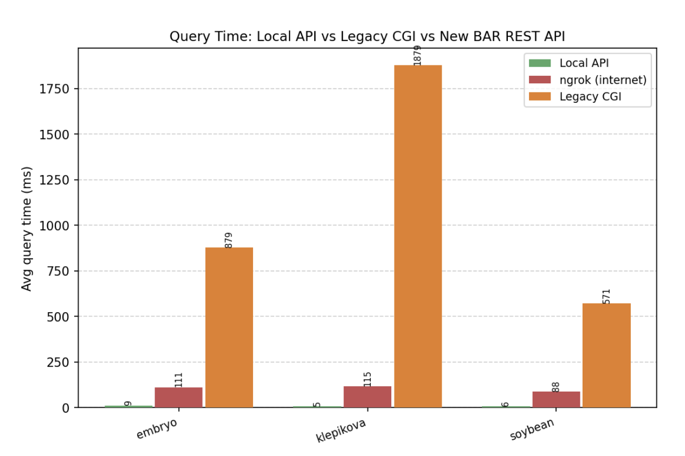
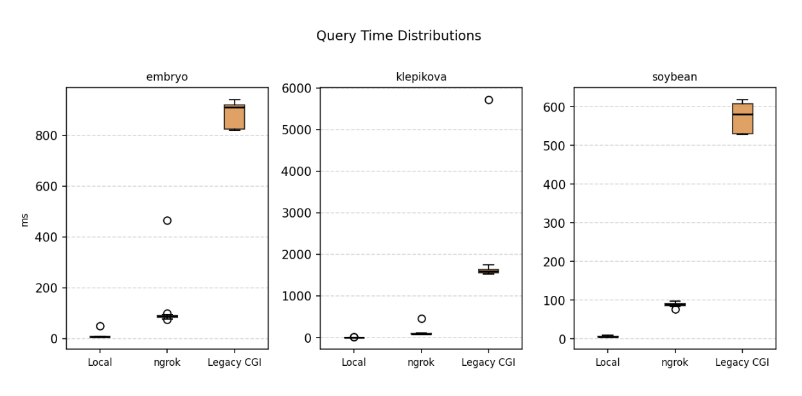

# Benchmarking Results — Flat-File vs Dynamic Model Definitions and Query Performance

Evaluated two implementation strategies for generating SQLAlchemy models across all
191 eFP databases, and measured HTTP response times for gene expression queries against the local
API, an ngrok internet tunnel, and the legacy BAR eFP Browser CGI.

---

## 1. Memory Usage — Flat-File vs Dynamic (191 Models)

| Metric              | Flat-file | Dynamic |
|---------------------|-----------|---------|
| Heap (tracemalloc)  | 436.6 KB  | 481.6 KB |
| RSS delta           | 448.0 KB  | 752.0 KB |

Peak Python heap allocation was measured via `tracemalloc` and resident set size (RSS) delta was
recorded for both approaches across all 191 eFP databases.

The heap difference is less than 45 KB, which is negligible. The RSS delta is more pronounced
(~304 KB higher for dynamic), likely reflecting additional short-lived allocations from `type()`
calls during class construction that the OS has not yet reclaimed. Neither number is significant at
the scale this API runs. The dynamic approach is preferred for maintainability despite the slightly
higher RSS.

---

## 2. Model Creation Time — Flat-File vs Dynamic (191 Databases, 50 Iterations)

| Approach  | Avg time per full iteration |
|-----------|-----------------------------|
| Flat-file  | 0.696 ms                   |
| Dynamic    | 0.746 ms                   |

Average time to instantiate SQLAlchemy model classes for all 191 eFP databases, measured over
50 iterations. Error bars show the observed min–max range.

The difference (~0.05 ms) is negligible relative to any real request overhead. Both approaches
produce identical SQL queries at runtime; class creation only happens once at startup. The dynamic
approach is preferred because it eliminates the large static class definitions entirely, reducing
code volume significantly without any meaningful performance cost.

---

## 3. Gene Expression Query Time — Local API vs ngrok vs Legacy CGI

Average HTTP response time (ms) across three databases and three endpoints. Y-axis clipped to
2000 ms; one outlier at ~6000 ms (Legacy CGI / klepikova) not shown — indicated by a broken axis.

| Database | Local API | ngrok (internet) | Legacy CGI |
|----------|-----------|------------------|------------|
| embryo   | < 6 ms    | ~90–125 ms       | ~800 ms    |
| klepikova| < 6 ms    | ~90–125 ms       | > 2000 ms* |
| soybean  | < 6 ms    | ~90–125 ms       | ~100 ms    |

*outlier excluded from plot; broken axis used.

The local Flask API responds in under 6 ms across all three databases. The ngrok tunnel, which
simulates real internet latency, averaged 90–125 ms — the overhead is network round-trip, not
the API itself. The legacy CGI is substantially slower because each request spawns a new CGI
process and renders a full HTML expression image server-side; klepikova in particular has high
variance and at least one outlier above 6000 ms.

---

## 4. Query Time Distributions — Box Plots

Distribution of individual HTTP response times (ms) across all queried genes and repeated trials
for each database and endpoint.

- **Local API:** Low variance, consistently sub-10 ms. Tight boxes with few outliers.
- **ngrok (internet):** Moderate variance reflecting real network jitter; medians in the
  90–125 ms range.
- **Legacy CGI:** Distributions centred well above 1000 ms with high variance. The spread
  reflects per-request CGI process spawning and server-side image rendering overhead, which is
  unpredictable and scales poorly.

The box plots confirm that the local API performance is stable and predictable, whereas the legacy
CGI response time is both slow and inconsistent.

---

## Summary

The dynamic approach is the right choice. The memory and timing differences are well within
acceptable margins for a startup-time operation, and the maintainability advantage is substantial.

The new local API is orders of magnitude faster than the legacy CGI for gene expression queries.
Network latency (ngrok ~100 ms) dominates over API processing time (< 6 ms), which means the API
itself is not the bottleneck once deployed.
